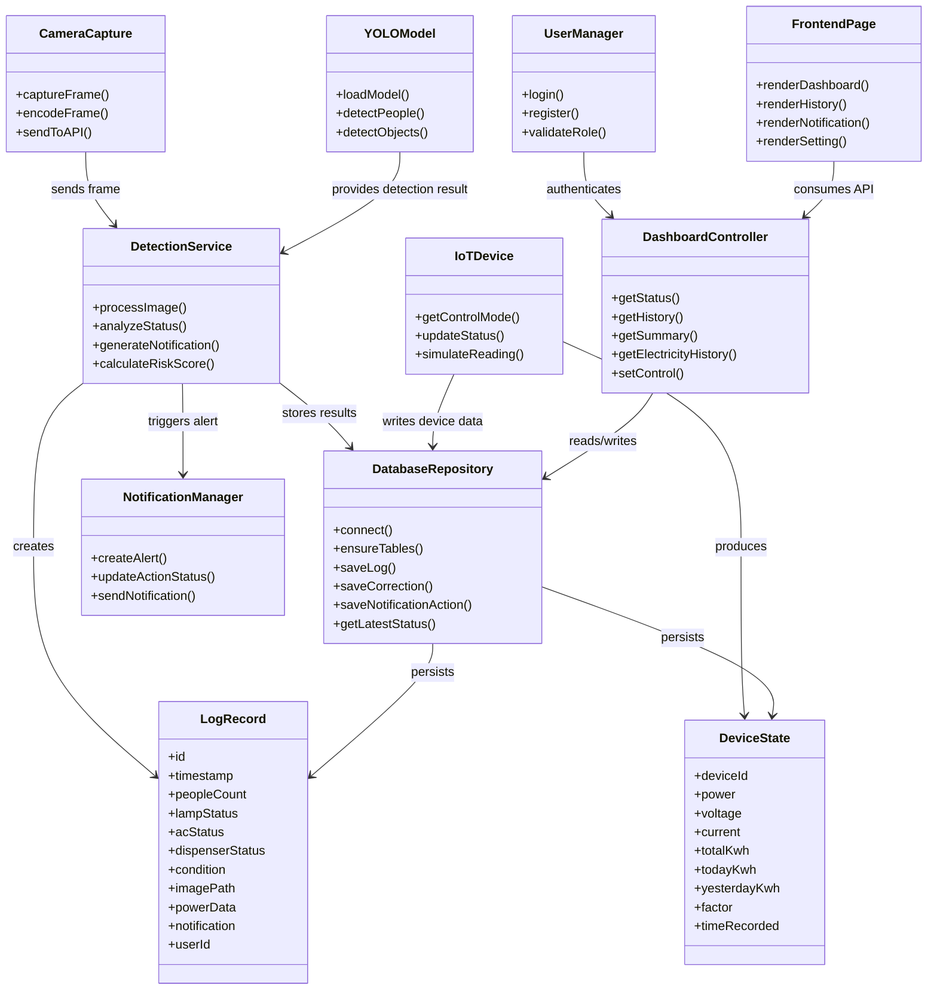

# Class Diagram - Hematrix Smart Monitoring

Berikut class diagram konseptual untuk sistem Hematrix berdasarkan arsitektur backend dan frontend yang ada:

Jika Anda mau, saya juga bisa bantu buat versi yang lebih formal untuk tugas sidang, misalnya:
- versi UML yang lebih rapi untuk laporan PDF
- versi yang menonjolkan backend saja
- versi yang menonjolkan hubungan frontend-backend-database
